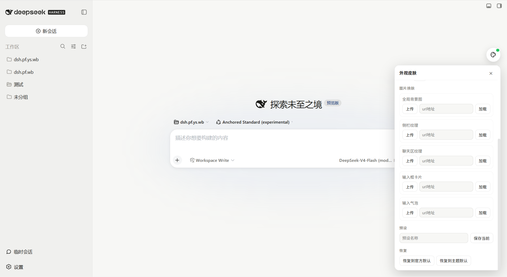
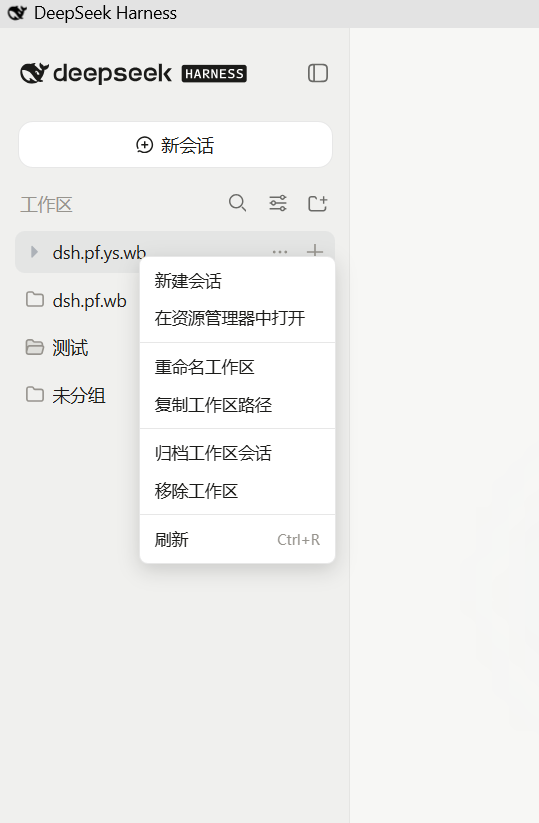
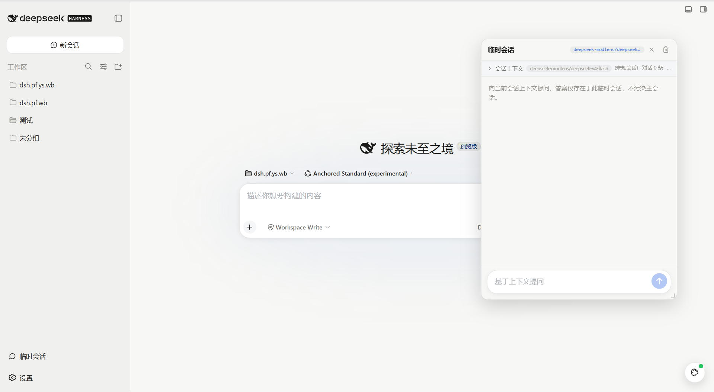
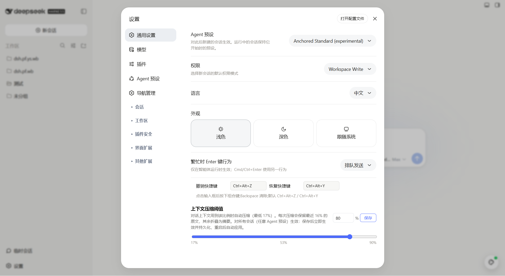
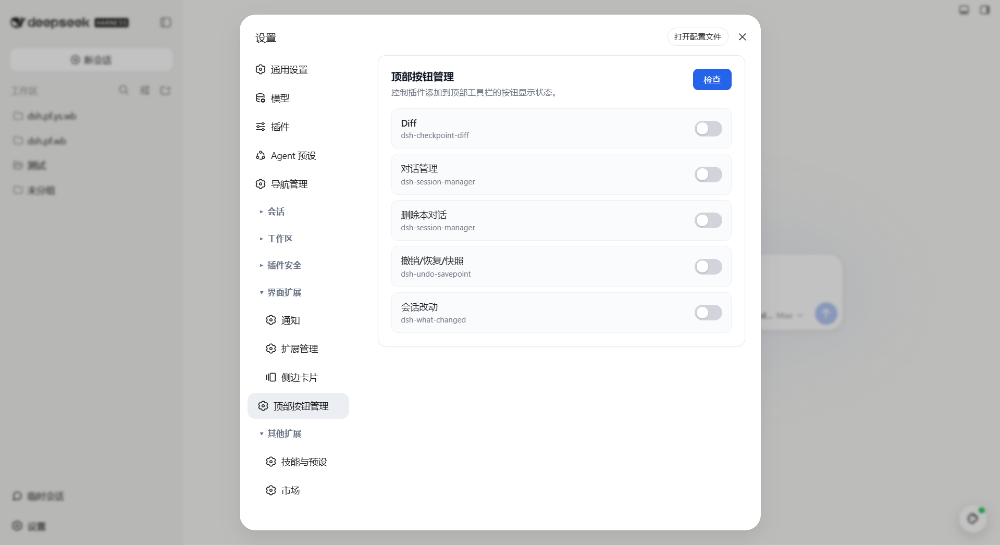
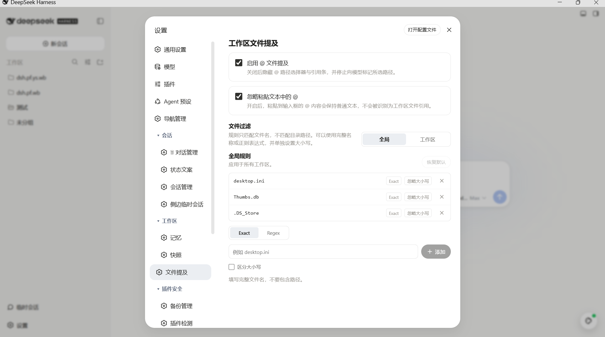

# 🧩 DeepSeek Harness 插件包 · Profile/Web 一键复刻

> 面向 DeepSeek Harness 社区生态的「插件包」分享仓库。  
> 包含 30 项插件/依赖、完整安装命令、可复刻提示词与预览截图。

## 📸 预览








## ✨ 这是什么

这是一个 **DeepSeek Harness（DSH）插件包**，目标是把一套完整的 `profile/web` 社区插件体系打包分享。

- 环境：`profile/web`
- 插件/依赖总数：30 项
- 包含：官方内置、社区插件、自研兼容插件、补丁配置
- 适用人群：希望快速复刻 DSH Web 端插件生态的用户

## 🚀 一键安装命令

在全新 DeepSeek Harness 中，依次执行以下命令即可安装本插件包中的社区插件：

```sh
# 官方内置：无需安装
# @deepseek-ai/dsh-base
# @deepseek-ai/dsh-web-app
dsh plugin --profile web add github:baihejiangnan/dsh-session-context-menu
dsh plugin --profile web add github:mishibeikejie/zat-dsh-engine
dsh plugin --profile web add @liustack/modlens
dsh plugin --profile web add billion-context-dsh
dsh plugin --profile web add dsh-better-sidebar
dsh plugin --profile web add dsh-checkpoint-diff
dsh plugin --profile web add dsh-extension-hub
dsh plugin --profile web add dsh-tdai-memory
dsh plugin --profile web add dsh-web-mobile-fix
dsh plugin --profile web add dsh-what-changed
dsh plugin --profile web add github:vlln/dsh-navbar
dsh plugin --profile web add github:huanyuLv/dsh-balance-tide
dsh plugin --profile web add github:christophersmith2737-commits/OffPeak
dsh plugin --profile web add github:dream12347/dsh-session-manager
dsh plugin --profile web add github:lire1131/dsh-undo-plugin
dsh plugin --profile web add github:baihejiangnan/dsh-topbar-manager
dsh plugin --profile web add github:hzhz314159/dsh-side-session
dsh plugin --profile web add "https://github.com/omdsh-dev/dsh-at-file/archive/refs/tags/v0.6.3.tar.gz"
dsh plugin --profile web add github:omdsh-dev/dsh-genui
dsh plugin --profile web add github:titanwings/dsh-automation
dsh plugin --profile web add github:omdsh-dev/dsh-notification
dsh plugin --profile web add dsh-status-rotator
dsh plugin --profile web add github:a179-sanae/dsh-auto-collapse#main
dsh plugin --profile web add github:lxzy-7/dsh-plugin-guard
dsh plugin --profile web add github:LX2000WASD/dsh-web-plugin-manager
dsh plugin --profile web add github:chenw2759-wq/dsh-plugin-healthcheck
dsh plugin --profile web add "https://codeload.github.com/baihejiangnan/dsh-settings-organizer/tar.gz/refs/tags/v1.1.0"
# dsh-skin（建议使用以下 GitHub 源安装）
dsh plugin --profile web add github:wei-806206088/dsh-skin
```

> 如果当前 DSH 启用了安装保护，请使用：
> ```sh
> dshpm install <包名> --profile web
> ```

## 机器可读插件包清单

本仓库同时提供 [`dsh-plugin-pack.json`](dsh-plugin-pack.json)，供插件包市场和启动器直接读取。清单包含 28 个可安装插件；README 中提到的两个 `@deepseek-ai` 项目属于 DSH 官方内置插件，因此没有重复放入安装清单。

清单使用 DSH Plugin Pack Schema v1，市场应将本仓库声明为 `json-manifest` 格式，并读取 `dsh-plugin-pack.json`。README 中的命令仍保留，方便用户手动复刻和核对安装来源。

## 📋 完整复刻提示词

可以直接把下面的提示词发给别人，或粘贴给一台全新的 DeepSeek Harness 助手。

📄 独立文件：[`PROMPT.md`](PROMPT.md)

<details>
<summary>点击展开完整提示词</summary>

# 可发送给别人的 DSH 插件体系复刻提示词

> 直接把下面「提示词正文」复制发给对方，或粘贴给一台全新的 DeepSeek Harness 助手。

---

## 提示词正文

你是 DeepSeek Harness 环境配置助手。请帮我在一台**原生、未安装任何社区插件**的 DeepSeek Harness 上，完整复刻以下 `profile/web` 插件体系。

### 目标

- Profile 名称：`web`
- 目标目录：`~/.dsh/profiles/web`（Windows 为 `C:\Users\<用户名>\.dsh\profiles\web`）
- 参考备份：`dsh-backup-web-2026-08-19.json`
- 最终应包含 **30 项**插件/依赖，与我的环境一致。

### 执行步骤

#### 1. 准备 profile

如果还没有 `web` profile，请先创建或进入：

```sh
dsh web
```

确保 `~/.dsh/profiles/web` 存在。

#### 2. 安装插件

请依次执行下面的命令。若当前 DSH 启用了安装保护，请把 `dsh plugin --profile web add ...` 替换为 `dshpm install <包名> --profile web`，或通过插件市场安装。

```sh
# @deepseek-ai/dsh-base 官方内置，无需安装
# @deepseek-ai/dsh-web-app 官方内置，无需安装
dsh plugin --profile web add github:baihejiangnan/dsh-session-context-menu
dsh plugin --profile web add github:mishibeikejie/zat-dsh-engine
dsh plugin --profile web add @liustack/modlens
dsh plugin --profile web add billion-context-dsh
dsh plugin --profile web add dsh-better-sidebar
dsh plugin --profile web add dsh-checkpoint-diff
dsh plugin --profile web add dsh-extension-hub
dsh plugin --profile web add dsh-tdai-memory
dsh plugin --profile web add dsh-web-mobile-fix
dsh plugin --profile web add dsh-what-changed
dsh plugin --profile web add github:vlln/dsh-navbar
dsh plugin --profile web add github:huanyuLv/dsh-balance-tide
dsh plugin --profile web add github:christophersmith2737-commits/OffPeak
dsh plugin --profile web add github:dream12347/dsh-session-manager
dsh plugin --profile web add github:lire1131/dsh-undo-plugin
dsh plugin --profile web add github:baihejiangnan/dsh-topbar-manager
dsh plugin --profile web add github:hzhz314159/dsh-side-session
dsh plugin --profile web add "https://github.com/omdsh-dev/dsh-at-file/archive/refs/tags/v0.6.3.tar.gz"
dsh plugin --profile web add github:omdsh-dev/dsh-genui
dsh plugin --profile web add github:titanwings/dsh-automation
dsh plugin --profile web add github:omdsh-dev/dsh-notification
dsh plugin --profile web add dsh-status-rotator
dsh plugin --profile web add github:a179-sanae/dsh-auto-collapse#main
dsh plugin --profile web add github:lxzy-7/dsh-plugin-guard
dsh plugin --profile web add github:LX2000WASD/dsh-web-plugin-manager
dsh plugin --profile web add github:chenw2759-wq/dsh-plugin-healthcheck
dsh plugin --profile web add "https://codeload.github.com/baihejiangnan/dsh-settings-organizer/tar.gz/refs/tags/v1.1.0"
# dsh-skin (当前 profile 原为 workspace:*，建议按以下 GitHub 源安装)
dsh plugin --profile web add github:wei-806206088/dsh-skin
```

#### 3. 补丁配置

安装完成后，请检查 `~/.dsh/profiles/web/cordis.patch.yml`，确保包含以下内容（用于加载 `dsh-skin`，并保持我的默认 agent 预设）：

```yaml
# 可选：与我一致的默认 agent 预设
- id: agent-presets
  config:
    default: anchored-standard

# 插入 dsh-skin
- insert:
    - id: dsh-skin
      name: 'dsh-skin'
```

#### 4. 验证

- 启动 `dsh web`
- 在设置 → 插件中确认已加载上述 30 项
- 如有插件市场/管理插件，可再用它做一次完整性检查

### 插件明细（含版本与安装源）

| # | 包名 | 版本 | 安装源 | 命令 |
|---:|---|---|---|---|
| 1 | **@deepseek-ai/dsh-base** | 内置 | 官方内置 | 无需安装 |
| 2 | **@deepseek-ai/dsh-web-app** | 内置 | 官方内置 | 无需安装 |
| 3 | **@baihejiangnan/dsh-session-context-menu** | 0.2.14 | `github:baihejiangnan/dsh-session-context-menu` | `dsh plugin --profile web add github:baihejiangnan/dsh-session-context-menu` |
| 4 | **zat-dsh-engine** | 0.6.2 | `github:mishibeikejie/zat-dsh-engine` | `dsh plugin --profile web add github:mishibeikejie/zat-dsh-engine` |
| 5 | **@liustack/modlens** | 3.18.6 | `3.18.6` | `dsh plugin --profile web add @liustack/modlens` |
| 6 | **billion-context-dsh** | 0.2.2 | `^0.2.2` | `dsh plugin --profile web add billion-context-dsh` |
| 7 | **dsh-better-sidebar** | 0.12.3 | `^0.12.3` | `dsh plugin --profile web add dsh-better-sidebar` |
| 8 | **dsh-checkpoint-diff** | 0.5.0 | `^0.5.0` | `dsh plugin --profile web add dsh-checkpoint-diff` |
| 9 | **dsh-extension-hub** | 0.2.13 | `^0.2.13` | `dsh plugin --profile web add dsh-extension-hub` |
| 10 | **dsh-tdai-memory** | 0.2.10 | `^0.2.10` | `dsh plugin --profile web add dsh-tdai-memory` |
| 11 | **dsh-web-mobile-fix** | 1.0.2 | `^1.0.2` | `dsh plugin --profile web add dsh-web-mobile-fix` |
| 12 | **dsh-what-changed** | 0.4.0 | `^0.4.0` | `dsh plugin --profile web add dsh-what-changed` |
| 13 | **@vlln/dsh-navbar** | 0.3.0 | `github:vlln/dsh-navbar` | `dsh plugin --profile web add github:vlln/dsh-navbar` |
| 14 | **dsh-balance-tide** | 0.2.0 | `github:huanyuLv/dsh-balance-tide` | `dsh plugin --profile web add github:huanyuLv/dsh-balance-tide` |
| 15 | **dsh-offpeak** | 1.0.0 | `github:christophersmith2737-commits/OffPeak` | `dsh plugin --profile web add github:christophersmith2737-commits/OffPeak` |
| 16 | **dsh-session-manager** | 0.1.9 | `github:dream12347/dsh-session-manager` | `dsh plugin --profile web add github:dream12347/dsh-session-manager` |
| 17 | **dsh-undo-savepoint** | 0.3.5 | `github:lire1131/dsh-undo-plugin` | `dsh plugin --profile web add github:lire1131/dsh-undo-plugin` |
| 18 | **dsh-topbar-manager** | 0.3.0 | `github:baihejiangnan/dsh-topbar-manager` | `dsh plugin --profile web add github:baihejiangnan/dsh-topbar-manager` |
| 19 | **@dsh-external/dsh-side-session** | 0.3.0 | `github:hzhz314159/dsh-side-session` | `dsh plugin --profile web add github:hzhz314159/dsh-side-session` |
| 20 | **dsh-at-file** | 0.6.3 | `https://github.com/omdsh-dev/dsh-at-file/archive/refs/tags/v0.6.3.tar.gz` | `dsh plugin --profile web add "https://github.com/omdsh-dev/dsh-at-file/archive/refs/tags/v0.6.3.tar.gz"` |
| 21 | **@omdsh-dev/dsh-genui** | 0.8.7 | `github:omdsh-dev/dsh-genui` | `dsh plugin --profile web add github:omdsh-dev/dsh-genui` |
| 22 | **@dsh-external/dsh-automation** | 0.1.6 | `github:titanwings/dsh-automation` | `dsh plugin --profile web add github:titanwings/dsh-automation` |
| 23 | **dsh-notification** | 0.1.2 | `github:omdsh-dev/dsh-notification` | `dsh plugin --profile web add github:omdsh-dev/dsh-notification` |
| 24 | **dsh-status-rotator** | 0.3.0 | `^0.3.0` | `dsh plugin --profile web add dsh-status-rotator` |
| 25 | **dsh-auto-collapse** | 0.1.3 | `github:a179-sanae/dsh-auto-collapse#main` | `dsh plugin --profile web add github:a179-sanae/dsh-auto-collapse#main` |
| 26 | **dsh-plugin-guard** | 0.3.2 | `github:lxzy-7/dsh-plugin-guard` | `dsh plugin --profile web add github:lxzy-7/dsh-plugin-guard` |
| 27 | **dsh-web-plugin-manager** | 0.4.6 | `github:LX2000WASD/dsh-web-plugin-manager` | `dsh plugin --profile web add github:LX2000WASD/dsh-web-plugin-manager` |
| 28 | **dsh-plugin-healthcheck** | 0.1.0 | `github:chenw2759-wq/dsh-plugin-healthcheck` | `dsh plugin --profile web add github:chenw2759-wq/dsh-plugin-healthcheck` |
| 29 | **dsh-settings-organizer** | 1.1.0 | `https://codeload.github.com/baihejiangnan/dsh-settings-organizer/tar.gz/refs/tags/v1.1.0` | `dsh plugin --profile web add "https://codeload.github.com/baihejiangnan/dsh-settings-organizer/tar.gz/refs/tags/v1.1.0"` |
| 30 | **dsh-skin** | 1.0.0 | `github:wei-806206088/dsh-skin` | `dsh plugin --profile web add github:wei-806206088/dsh-skin` |

---

> 提示：命令中的版本/来源来自我 2026-08-19 的 profile/web 导出；如果某些插件已更新，安装结果可能与我的版本略有差异。


</details>

## 🛠️ 自研兼容插件

为了尽可能提升本插件包在不同 DSH 环境下的兼容性，我加入了以下自研插件：

1. **dsh-settings-organizer**（兼容插件 1）  
   https://github.com/baihejiangnan/dsh-settings-organizer

2. **dsh-topbar-manager**（兼容插件 2）  
   https://github.com/baihejiangnan/dsh-topbar-manager

### 为什么需要兼容插件？

DeepSeek Harness 的插件社区发展很快，不同插件可能由不同作者维护，对 DSH 版本、UI 结构、设置面板和顶部工具栏的假设也不完全一致。如果直接把大量社区插件组合进同一个 `profile/web`，很容易出现以下问题：

- **设置入口分散**：每个插件各自往设置页添加入口，用户很难找到和管理配置。
- **顶部按钮冲突**：多个插件同时向顶栏注册按钮，容易重叠、遮挡、顺序混乱。
- **版本适配不一致**：插件 A 适配了新版本，插件 B 还停留在旧接口，组合后可能出现加载失败或样式错乱。
- **排障成本高**：出问题时难以判断是哪个插件、哪个配置、哪个版本导致的。

### 这两个插件分别优化了什么？

#### 1. dsh-settings-organizer

- 把散落在 DSH 设置页里的插件配置进行**分层、归类、导航化**。
- 让用户在一个统一、可搜索的设置结构中管理插件，而不是在不同插件各自的位置里翻找。
- 降低多插件环境下的配置认知负担，也减少“装了但不知道去哪设置”的体验断裂。

#### 2. dsh-topbar-manager

- 统一管理多个插件向 DSH Web 顶栏注册的按钮。
- 提供**检查、开关、排序/归类**能力，避免顶栏按钮过多、互相遮挡或顺序混乱。
- 让 UI 在插件数量增加后仍然保持整洁、可控，减少视觉冲突和误点。

### 为什么必须要兼容插件？

因为“能安装”和“能一起稳定工作”是两回事。这个插件包的目标不是简单罗列 30 个插件，而是让它们组合成一个**开箱即用、少冲突、好维护**的 DSH 环境。兼容插件相当于插件包的“粘合层”：

- 统一设置体验
- 统一顶栏秩序
- 缓冲不同插件对 DSH 版本的接口差异
- 让后续新增/移除插件时更安全、更容易回滚

所以，`dsh-settings-organizer` 和 `dsh-topbar-manager` 是这套插件包中负责“兼容与体验收敛”的关键部分。

## 🤝 致谢

感谢以下社区项目与作者：

- [awesome-dsh-plugin](https://github.com/awesome-dsh-plugin/awesome-dsh-plugin) — DSH 插件精选列表
- [dsh-market](https://github.com/dsh-market/dsh-market) — DSH 可视化插件市场
- 本插件包中所有第三方插件的作者与维护者
- DeepSeek Harness 社区

## 📄 开源证明

本仓库使用 **MIT License** 开源，详见 [`LICENSE`](LICENSE)。

---

> 数据导出时间：2026-08-19 ｜ 环境：`C:/Users/ABD18/.dsh/profiles/web`
